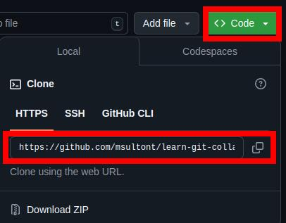
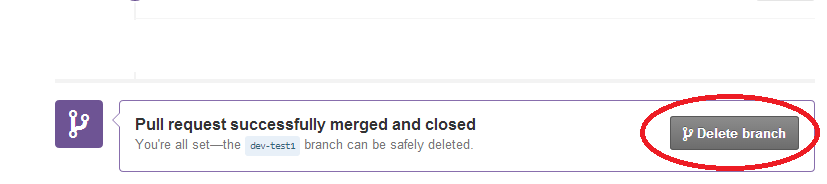

# Panduan Kolaborasi untuk Pemula


[](https://www.firsttimersonly.com/)
<!-- [](https://hits.seeyoufarm.com)
[](https://www.buymeacoffee.com/idiomprog) -->

Belajar berkolaborasi dapat terasa sulit dan membingungkan bagi kontributor pemula saat pertama kali, dan mungkin terasa membosankan untuk menemukan proyek open source yang bisa dikontribusikan tanpa pengetahuan pemrograman yang memadai. Tapi jangan khawatir, proyek ini dibuat khusus pemula untuk memudahkan proses kontribusi bagi pendatang baru.

<!-- > Lihat kontributor luar biasa lainnya dari proyek ini [di sini.](https://udit-001.github.io/Collaboration-For-Beginners/Contributors) -->

## Panduan Kontribusi

Berikut langkah-langkah untuk berkontribusi pada proyek ini:

1. Beri bintang pada repositori ini.
2. Fork repositori ini.


3. Clone fork yang baru saja Anda buat ke komputer Anda.



Ketik perintah berikut pada konsol Git Bash:
```git
git clone https://github.com/msultont/learn-git-collaboration
```

Ganti tautan repo git di atas dengan fork yang baru saja Anda buat.

4. Sebelum membuat perubahan pada file, kita akan mencoba cara yang lebih efisien daripada tutorial biasa.

Untuk itu, buka terminal di bawah repo yang baru saja Anda clone, lalu ketik:

```
git checkout -b add-my-name
```

Dengan menjalankan perintah di atas, Anda membuat branch baru bernama add-my-name dan beralih ke sana. Ini membuat branch baru dengan riwayat commit dari branch master atau branch sebelumnya.

5. Sekarang buka file Contributors.md dan masukkan detail Anda dalam format berikut:

```
#### Name: [NAMA ANDA](Tautan GitHub)
- Tempat: Kota, Negara
- Bio: Siapa Anda?
- GitHub: [Nama Anda](Tautan GitHub)
```

6. Masukkan perintah berikut ke dalam terminal Anda:
```
git add Contributors.md
git commit -m "Menambahkan diri saya ke Contributors.md"
git push origin add-my-name
```

Ini akan membuat commit baru dengan perubahan pada file Contributors.md. Kemudian, perubahan ini di-push ke branch add-my-name pada fork Anda.

7. Sekarang buat pull request dengan judul "Menambahkan diri saya ke Contributors.md"


8. Duduk santai sambil menunggu pull request Anda direview dan di-merge.

## Proses Pembersihan

Setelah pull request Anda di-merge ke proyek, Anda dapat dengan aman menghapus branch add-my-name yang Anda buat sebelumnya.

Anda bisa melakukannya melalui UI GitHub, cukup buka pull request Anda dan Anda akan melihat opsi seperti ini:



Klik "delete branch", dan selesai.

## Menyinkronkan Fork
Jika Anda hanya ingin berkontribusi satu kali, langkah-langkah di atas sudah cukup. Namun, jika Anda ingin berkontribusi secara rutin, Anda akan menghadapi masalah umum: bagaimana memperbarui fork Anda dengan perubahan pada proyek asli. Berikut langkah-langkahnya:

1. Tambahkan remote untuk proyek asli ke repositori lokal fork Anda. Masukkan perintah berikut ke terminal:

```
git remote add upstream https://github.com/udit-001/Collaboration-For-Beginners.git
```

Ini menambahkan remote dengan nama upstream ke proyek asli.

2. Jika ada perubahan di repositori lokal Anda, commit atau stash perubahan tersebut. Lalu masukkan perintah berikut:

```
git pull upstream master 
```

Sekarang repositori Anda sudah diperbarui dengan perubahan di proyek asli.

3. Terakhir, perbarui fork Anda di GitHub. Ketik perintah berikut:

```
git push origin master
```

Sekarang, fork Anda juga sudah diperbarui.